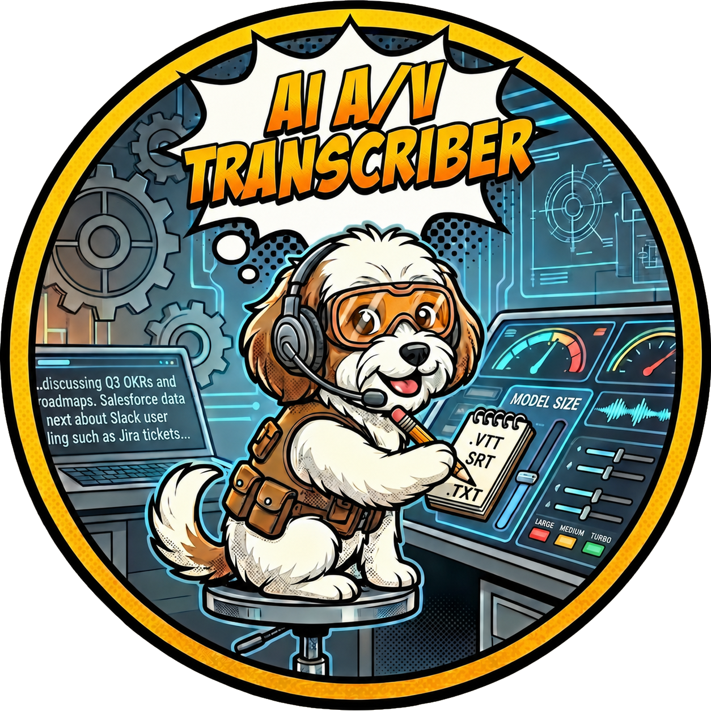

# AI Audio & Video Transcriber
**Version:** 1.1.0

**Author:** Ed Johnson (Making With An EdJ)

**Transcribe audio and video files locally, privately, and entirely offline — no cloud upload.**



---

## What It Does

Transcribes audio and video files to text using AI speech recognition powered by [OpenAI Whisper](https://github.com/openai/whisper). At the start of each session you choose which output format(s) to produce — all are saved alongside the original file:

- `.vtt` — WebVTT subtitles (web / HTML5 video players)
- `.srt` — SubRip subtitles (DaVinci Resolve, Premiere, YouTube, VLC)
- `.txt` — Plain text transcript (no timestamps; great for reading or feeding to an LLM)
- **All** — Output all three at once (default)

## Supported Formats

| Audio | Video |
|-------|-------|
| `.mp3` `.m4a` `.wav` `.flac` `.aac` | `.mp4` `.mov` `.mkv` `.avi` `.flv` |

## Script

`ai_transcriber.py` — Cross-platform, drag-and-drop or interactive menu, selectable output formats (VTT / SRT / TXT / All), tuned Whisper parameters. On Mac, routes to a compiled `whisper.cpp` binary when available; on Windows uses the `openai-whisper` Python package.

---

## Prerequisites

- **Python 3.9+** installed and available on your PATH
- **FFmpeg** — place `ffmpeg.exe` (Windows) or `ffmpeg` (Mac) in the project folder, or install it system-wide via Homebrew (`brew install ffmpeg`) or [ffmpeg.org](https://ffmpeg.org/)
- **Mac only (recommended):** a compiled `whisper.cpp` binary — see [Building whisper.cpp](#building-whispercpp-mac-only) below

---

## First-Time Setup

### Windows

```powershell
python setup.py
```

This creates `venv_win\` and installs `openai-whisper` and `torch`. Activate before running:

```powershell
venv_win\Scripts\activate
python ai_transcriber.py
```

### Mac — with whisper.cpp (recommended for Apple Silicon)

First build whisper.cpp (see [Building whisper.cpp](#building-whispercpp-mac-only) below), then:

```bash
python setup.py
source venv_mac/bin/activate
python ai_transcriber.py
```

When `whisper.cpp/build/bin/whisper-cli` and the model files are present, the script uses the fast C++ binary automatically. No heavy Python ML packages are required for transcription.

### Mac — Python fallback (no whisper.cpp)

```bash
python setup.py
source venv_mac/bin/activate
python ai_transcriber.py
```

If whisper.cpp is not found, the script falls back to the Python Whisper package with the same tuned parameters. Slower than whisper.cpp but identical output quality.

---

## Building whisper.cpp (Mac Only)

whisper.cpp provides significantly faster transcription on Apple Silicon (M1/M2/M3/M4) using Metal GPU acceleration. This is the recommended setup for Mac users.

### 1. Clone into the project directory

Run this from inside the `AI_Transcriber` project folder:

```bash
git clone https://github.com/ggerganov/whisper.cpp
```

This creates `whisper.cpp/` as a subfolder — exactly where the script expects it.

### 2. Build

```bash
cd whisper.cpp
cmake -B build
cmake --build build --config Release -j $(sysctl -n hw.logicalcpu)
cd ..
```

Metal GPU support is enabled automatically on Apple Silicon. The build takes 2–5 minutes.

### 3. Download the transcription model

From inside the `whisper.cpp/` folder:

```bash
bash models/download-ggml-model.sh large-v3-turbo
```

This downloads `ggml-large-v3-turbo.bin` (~800 MB) into `whisper.cpp/models/`. Check the [whisper.cpp model list](https://github.com/ggerganov/whisper.cpp/blob/master/models/README.md) for other available sizes.

### 4. Download the VAD model (silence detection — optional but recommended)

Voice Activity Detection filters out silence, improving accuracy and speed on recordings with pauses. Download the Silero VAD model into `whisper.cpp/models/`:

```bash
# Check whisper.cpp/models/ for the latest download options:
bash models/download-ggml-model.sh silero-vad
```

> The script expects `ggml-silero-v5.1.2.bin`. If a newer version is downloaded, update `VAD_MODEL_PATH` in `ai_transcriber.py` to match. If the file is absent, the script runs without VAD automatically — no error.

### Expected directory structure after setup

```
AI_Transcriber/
├── ai_transcriber.py
├── setup.py
├── requirements_win.txt
├── requirements_mac.txt
├── ffmpeg  (or ffmpeg.exe on Windows)
├── venv_mac/                   ← created by setup.py on Mac
├── venv_win/                   ← created by setup.py on Windows
└── whisper.cpp/                ← cloned from GitHub (Mac)
    ├── build/
    │   ├── bin/
    │   │   └── whisper-cli     ← compiled binary
    │   ├── src/                ← shared libraries (required at runtime)
    │   └── ggml/
    │       └── src/            ← shared libraries (required at runtime)
    └── models/
        ├── ggml-large-v3-turbo.bin
        └── ggml-silero-v5.1.2.bin
```

---

## Running the Transcriber

```bash
# Interactive menu — scans the current folder for media files
python ai_transcriber.py

# Direct file mode — pass one or more files (drag-and-drop on Mac/Windows also works)
python ai_transcriber.py "interview.mp4" "meeting.m4a"
```

On Windows (or Mac without whisper.cpp), you will be prompted to choose a Whisper model size before transcription begins. The model is loaded once and reused for all files in the queue.

---

## Portable External Drive Setup

Carrying the full project on an external drive is supported. Each machine only needs `python setup.py` run once to build its venv.

### Drive letter caveat (Windows)

Virtual environments bake in the absolute path they were created at. If your drive is assigned a different letter on another Windows machine (e.g. `D:` on one PC and `E:` on another), `venv_win` will break.

**Fix:**
```powershell
rmdir /s /q venv_win
python setup.py
```

Pip caches downloaded packages locally on the host machine, so reinstallation is fast. Whisper model weights are cached in `%LOCALAPPDATA%\whisper` on the host — not on the drive — and will be re-downloaded once on any new machine.

### Mac mount paths

Mac volumes mount by name (e.g. `/Volumes/MyDrive`) and are stable across machines as long as the drive name does not change. `venv_mac` will generally survive moving between Macs without rebuilding.

### What to carry on the drive

| Item | Notes |
|------|-------|
| All `.py` source files | Core scripts |
| `ffmpeg` and `ffmpeg.exe` | Keep both for cross-platform use |
| `requirements_win.txt`, `requirements_mac.txt`, `setup.py` | For fast venv rebuild on any machine |
| `whisper.cpp/` (with build and models) | Large but saves re-cloning, rebuilding, and re-downloading models |
| `venv_mac/`, `venv_win/` | Optional — rebuild with `setup.py` if paths break |

> Add `venv_mac/` and `venv_win/` to `.gitignore`. Do not commit them to version control.

---

## Usage Tips

**Model selection (Windows / Python path)**
When whisper.cpp is not available, a model menu appears at startup:

- **Turbo** — Best speed/accuracy balance. Recommended default.
- **Medium** — Slower, but better on heavy accents or low-quality audio.
- **Large** — Maximum accuracy. Requires ~10 GB RAM.

The model loads once per session and is reused across all files.

**Processing time**
Long recordings (1 hour+) can take several minutes even on fast hardware. The terminal shows segment-by-segment progress so you can see it is working.

**Customizing the initial prompt**
Edit `INITIAL_PROMPT` at the top of `ai_transcriber.py` to prime Whisper with domain-specific vocabulary, speaker names, or punctuation preferences. This meaningfully improves accuracy for specialized or technical content.

The repo already includes commented example prompts in `ai_transcriber.py` for the business meeting and software tutorial cases. Uncomment one of those templates to use a tested prompt directly, or replace it with your own.

A good prompt briefly describes the context and the vocabulary Whisper is likely to encounter. Mention specific terms, product names, or abbreviations it might mishear, and tell it the tone you want for punctuation and capitalization. One or two sentences is usually enough.

*Business Zoom meeting:*
```python
INITIAL_PROMPT = "This is a recorded business meeting. Attendees are discussing Q3 results, OKRs, project roadmaps, and action items. Tools referenced include Salesforce, Jira, and Slack. Use professional capitalization and punctuation throughout."
```

*Casual video call among friends:*
```python
INITIAL_PROMPT = "This is a casual video call between friends. Conversation is informal with natural pauses, laughter, and tangents. Transcribe filler words like 'like,' 'you know,' and 'I mean' as spoken. Punctuation should reflect natural speech rhythm."
```

*YouTube tutorial video:*
```python
INITIAL_PROMPT = "This is a software tutorial video. The presenter walks through step-by-step instructions using technical terminology, keyboard shortcuts, and code examples. Preserve exact capitalization for all product names, commands, and technical terms."
```

*Podcast or interview:*
```python
INITIAL_PROMPT = "This is a podcast interview between a host and a guest. Both speakers are knowledgeable and articulate. Maintain consistent punctuation throughout. Insert paragraph breaks at natural topic changes."
```

> **Tip:** If you know the speaker's name or specific jargon that will appear frequently (e.g. a product name, a person's name, a technical acronym), include it in the prompt — Whisper will be far less likely to mishear or misspell it.

**Skipping already-transcribed files**
The script always overwrites existing output files. If you need skip-already-done behavior for large batches, use the interactive menu to select only the files you want to process.

---

## Tech Stack

For the fellow coders and makers out there, here is how AI Transcriber was built:

* **Language:** Python 3.x
* **Speech Recognition:** OpenAI Whisper (Python package on Windows; whisper.cpp C++ binary on Mac)
* **Mac Acceleration:** whisper.cpp with Metal GPU support for Apple Silicon (M1/M2/M3/M4)
* **Audio Extraction:** FFmpeg — converts any audio/video format to 16kHz mono WAV before Whisper processing
* **ML Backend (Windows):** PyTorch — detects CUDA automatically and enables GPU acceleration when available

## Acknowledgements & Credits

* **Developer:** Ed Johnson ([Making With An EdJ](https://www.youtube.com/@makingwithanedj))
* **AI Assistance:** Developed with coding assistance from Anthropic's Claude (claude.ai/code).
* **OpenAI Whisper:** The speech recognition model at the heart of this tool.
  > Radford, A., et al. (2022). *Robust Speech Recognition via Large-Scale Weak Supervision.* OpenAI.
* **whisper.cpp:** Georgi Gerganov and contributors — blazing-fast C++ inference with Metal GPU support.
* **Lucy (The Cavachon Puppy):**
***Chief Wellness Officer & Director of Mandatory Breaks***
    * Thank you for ensuring I maintained healthy circulation by interrupting my deep coding sessions with urgent requests for play.
* **License:** Creative Commons Attribution-NonCommercial-ShareAlike 4.0 International License.

---

## ❤️ Support the Maker (and Lucy!)

I develop these tools to improve my own workflows and love sharing them with the community. If you find AI Transcriber useful and want to say thanks, feel free to **[buy Lucy a dog treat on Ko-fi](https://ko-fi.com/makingwithanedj)**!

***

*Happy Making!*
*— EdJ*
